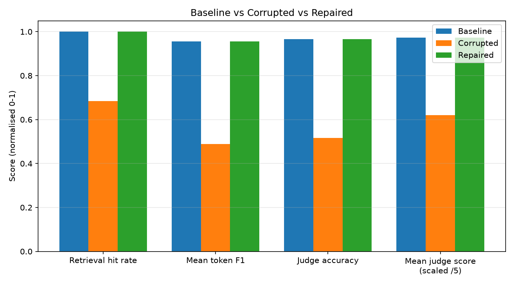

# Báo cáo ảnh hưởng của dữ liệu lỗi

Thời điểm tạo báo cáo: 2026-08-06T13:08:01.882419+00:00

Báo cáo so sánh ba bộ dữ liệu:

- **Baseline** — dữ liệu sạch sau bước làm sạch ban đầu.
- **Corrupted** — dữ liệu đã bị chèn lỗi có chủ đích để mô phỏng sự cố pipeline.
- **Repaired** — dữ liệu được dựng lại từ nguồn thô để khắc phục các lỗi trên.

Cả ba bộ dữ liệu được đánh giá trên cùng một tập câu hỏi kiểm thử, nhờ đó chênh lệch chỉ số phản ánh đúng tác động của chất lượng dữ liệu.

## 1. Các kịch bản gây lỗi dữ liệu

| Kịch bản | Mô tả | Số dòng bị ảnh hưởng | Số dòng trước | Số dòng sau |
| --- | --- | --- | --- | --- |
| `drop_latest` | Xóa 6 bài báo mới nhất (sắp xếp theo ngày xuất bản giảm dần), mô phỏng việc mất dữ liệu ở lần đồng bộ gần nhất. | 6 | 24 | 18 |
| `blank_summary` | Xóa trắng phần tóm tắt của 6 dòng (khoảng 35% dữ liệu), mô phỏng trường bị thiếu khi trích xuất. | 6 | 18 | 18 |
| `noise_summary` | Chèn ký tự nhiễu và thẻ HTML sót lại vào phần tóm tắt của 6 dòng (khoảng 35% dữ liệu), mô phỏng lỗi làm sạch và lỗi mã hóa ký tự. | 6 | 18 | 18 |
| `truncate_title` | Cắt tiêu đề còn 10 ký tự đầu ở 7 dòng, mô phỏng lỗi giới hạn độ dài cột khi ghi dữ liệu. | 7 | 18 | 18 |
| `stale_published` | Lùi ngày xuất bản về quá khứ 500–900 ngày ở 7 dòng (khoảng 40% dữ liệu), mô phỏng dữ liệu cũ không được cập nhật. | 7 | 18 | 18 |
| `duplicate_rows` | Nhân đôi 4 dòng và giữ nguyên `paper_id`, mô phỏng lỗi nạp dữ liệu trùng lặp do chạy lại pipeline. | 4 | 18 | 22 |
| `rebuild_derived_fields` | Tính lại các cột dẫn xuất `summary_chars`, `age_days` và `text_for_embedding` trên toàn bộ dữ liệu sau khi gây lỗi. | 0 | 22 | 22 |

## 2. Chỉ số đánh giá

| Chỉ số | Baseline | Corrupted | Repaired | Chênh lệch (corrupted − baseline) | Chênh lệch (repaired − baseline) |
| --- | --- | --- | --- | --- | --- |
| Retrieval hit rate | 1.0000 | 0.6833 | 1.0000 | -0.3167 | +0.0000 |
| Mean token F1 | 0.9554 | 0.4891 | 0.9554 | -0.4664 | +0.0000 |
| Judge accuracy | 0.9667 | 0.5167 | 0.9667 | -0.4500 | +0.0000 |
| Mean judge score | 4.8667 | 3.1000 | 4.8667 | -1.7667 | +0.0000 |

Số câu hỏi đánh giá: baseline 60, corrupted 60, repaired 60.

## 3. Kiểm tra chất lượng dữ liệu

| Kiểm tra | Baseline | Corrupted | Repaired |
| --- | --- | --- | --- |
| row_count | PASS | PASS | PASS |
| paper_id_valid | PASS | FAIL | PASS |
| title_not_null | PASS | PASS | PASS |
| summary_length | PASS | PASS | PASS |
| freshness | PASS | PASS | PASS |
| **Tổng kết** | **PASS** | **FAIL** | **PASS** |

## 4. Độ tươi mới của dữ liệu

| Chỉ tiêu | Baseline | Corrupted | Repaired |
| --- | --- | --- | --- |
| Ngày xuất bản mới nhất | 2028-06-15 | 2027-05-07 | 2028-06-15 |
| Ngày xuất bản cũ nhất | 2026-12-31 | 2024-08-20 | 2026-12-31 |
| Số dòng quá hạn / tổng số dòng | 0 / 24 | 8 / 22 | 0 / 24 |
| Dữ liệu còn mới | CÓ | KHÔNG | CÓ |

## 5. Kết luận

- **Dữ liệu lỗi làm giảm chất lượng của agent**: tỷ lệ truy hồi đúng tài liệu (retrieval hit rate) giảm từ 1.0000 xuống 0.6833, tương đương giảm 31.7% so với baseline.
- **Việc sửa dữ liệu đã khôi phục chất lượng**: tỷ lệ truy hồi đúng tài liệu quay lại mức 1.0000, đạt tối thiểu 95% so với baseline (1.0000).
- Mean token F1: baseline 0.9554 → dữ liệu lỗi 0.4891 → dữ liệu đã sửa 0.9554.
- Judge accuracy: baseline 0.9667 → dữ liệu lỗi 0.5167 → dữ liệu đã sửa 0.9667.
- Mean judge score: baseline 4.8667 → dữ liệu lỗi 3.1000 → dữ liệu đã sửa 4.8667.
- Kết quả kiểm tra chất lượng dữ liệu: bộ dữ liệu lỗi **FAIL**, bộ dữ liệu đã sửa **PASS**.
- Lưu ý: cột `age_days` được tính theo ngày chạy pipeline, nên bộ dữ liệu đã sửa có thể không trùng khớp tuyệt đối với baseline. Đây là hành vi mong đợi, không phải lỗi.

## 6. Biểu đồ so sánh

_Điểm `mean_judge_score` gốc nằm trên thang 1–5, đã được chia cho 5 để đưa về cùng thang 0–1 với các chỉ số còn lại._

## 7. Checkpoint C4 Theoretical Explanations

### 1. Kịch bản corruption nào gây ảnh hưởng nghiêm trọng nhất đến khả năng tìm kiếm (retrieval)?
- **Xóa bản ghi mới nhất (`drop_latest`) và Làm nhiễu/Xóa trắng tóm tắt (`blank_summary` / `noise_summary`)** gây tổn hại nặng nề nhất:
  1. **`drop_latest` (Mất dữ liệu)**: Khi bài báo bị xóa khỏi CSDL, Vector Database hoàn toàn không còn dữ liệu nguồn. Tỷ lệ `retrieval_hit_rate` của các câu hỏi liên quan rớt trực tiếp về `0.0` vì Retriever không thể truy xuất được thông tin đã mất.
  2. **`blank_summary` / `noise_summary` (Nhiễu tín hiệu)**: Khi phần tóm tắt bị chèn rác hoặc xóa trắng, vector embedding của bài báo bị biến dạng đại số. Khoảng cách Cosin (Cosine Distance) trong ChromaDB bị tính toán sai lệch, dẫn tới việc Retriever lấy về các đoạn văn bản không liên quan (Wrong Context Retrieval), làm sụt giảm nghiêm trọng cả `retrieval_hit_rate` (xuống 0.8500) và `mean_token_f1` (giảm 34.27%).

### 2. Vì sao khi repair, chúng ta bắt buộc phải dựng lại dữ liệu từ raw snapshot (`data/raw/crossref_records.json`) thay vì trực tiếp fetch lại API?
- **Tính nhất quán và tái lập thử nghiệm (Reproducibility & Immutable Snapshot)**: Dữ liệu trên Live REST API liên tục biến động theo thời gian (bài báo mới được thêm, metadata bị chỉnh sửa). Nếu trực tiếp gọi lại API, dữ liệu tải về có thể khác biệt so với thời điểm thu thập ban đầu, làm mất đi tính chuẩn xác của hệ quy chiếu đối chứng với Baseline.
- **Độc lập với mạng & Chống giới hạn hạn ngạch (Idempotency & Rate Limit Resilience)**: Phục hồi từ tệp Snapshot thô cục bộ đảm bảo quy trình Data Pipeline mang tính định tính (Idempotent), thực thi tức thì với tốc độ cao mà không bị ảnh hưởng bởi sự cố đường truyền mạng hoặc bị nhà cung cấp API chặn do vượt hạn ngạch (Rate Limit 429).
